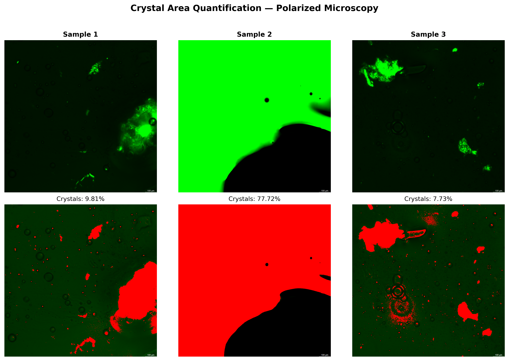
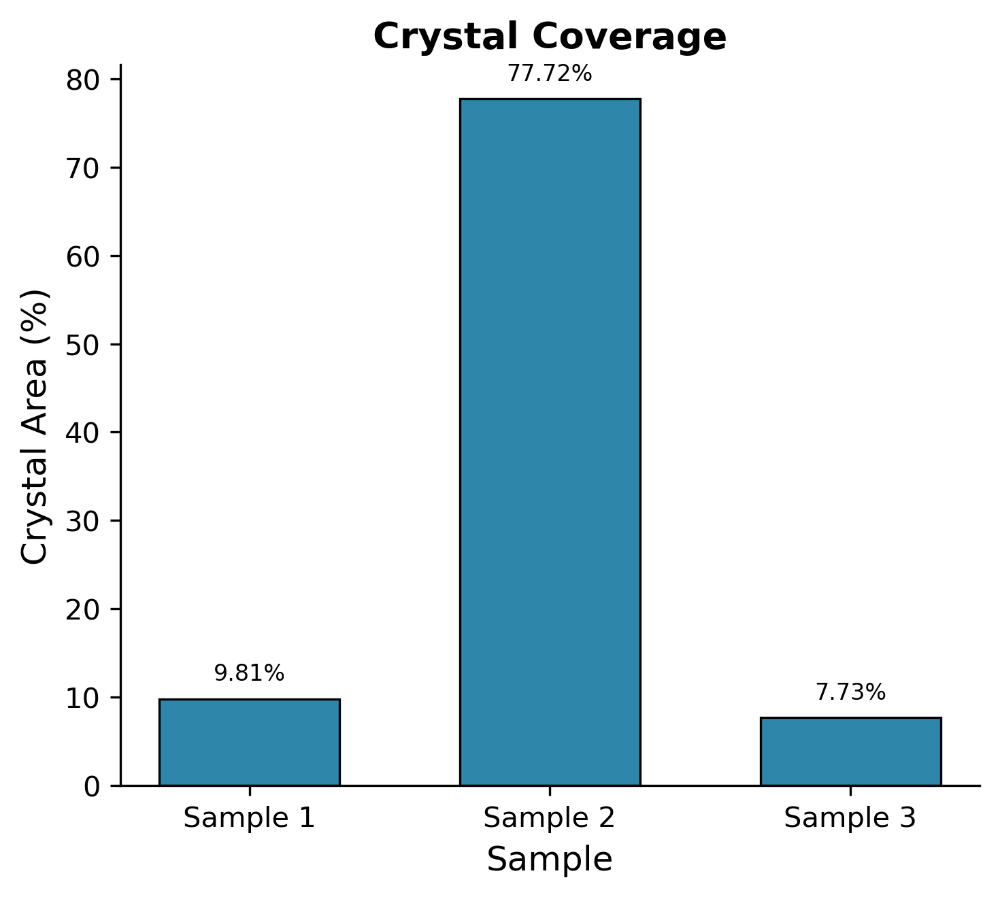

# Polarized Microscopy Crystal Area Analysis


Automated quantification of birefringent crystal area from polarized light microscopy images using adaptive thresholding and morphological image analysis.

## Overview

Under crossed polarizers, amorphous (isotropic) regions appear dark while crystalline domains exhibit birefringence and transmit light as bright regions. This tool segments and quantifies those bright crystalline regions, providing:

- **Crystal area fraction** (%) for each image
- **Connected-component statistics** (count, mean/median/max object size)
- **Publication-ready figures** (composite overlay + summary bar chart)
- **Reproducible CSV output** with full analysis parameters

## Algorithm

```
 Polarized image (RGB)
        │
        ▼
 Extract signal channel (green / brightness / grayscale)
        │
        ▼
 Estimate background from dark pixels (intensity < 128)
   ├── bg_median
   └── bg_MAD (median absolute deviation)
        │
        ▼
 Adaptive threshold:  T = max(μ_bg + k × MAD_bg, T_min)
        │
        ▼
 Binary mask  →  Morphological opening  →  Small-object removal
        │
        ▼
 Connected-component labelling  →  Area quantification
```

The adaptive threshold ensures consistent segmentation across images with widely varying crystal densities — from near-zero to near-complete coverage — by anchoring the threshold to the dark (non-crystal) pixel population rather than the global intensity distribution.

## Example Output

### Composite Segmentation

Top row: original polarized micrographs. Bottom row: detected crystal regions (red overlay).



### Crystal Area Chart



### CSV Results

| Sample | Crystal Area (%) | N Objects | Threshold |
|--------|-----------------|-----------|-----------|
| Sample 1 | 9.81 | 1,072 | 23.0 |
| Sample 2 | 77.72 | 5 | 10.0 |
| Sample 3 | 7.73 | 1,815 | 21.0 |

## Installation

```bash
git clone https://github.com/YOUR_USERNAME/polarized-microscopy-crystal-analysis.git
cd polarized-microscopy-crystal-analysis
pip install -r requirements.txt
```

**Dependencies:** NumPy, Pandas, scikit-image, Matplotlib, Pillow

## Usage

### Basic

```bash
python crystal_area_analysis.py --input example_data/
```

### Custom parameters

```bash
python crystal_area_analysis.py \
    --input path/to/images/ \
    --output path/to/results/ \
    --channel green \
    --k 3 \
    --min-threshold 15 \
    --format png \
    --dpi 150
```

### All options

```
usage: crystal_area_analysis.py [-h] -i INPUT [-o OUTPUT]
                                [--channel {green,brightness,grayscale}]
                                [--k K] [--min-threshold MIN_THRESHOLD]
                                [--scale-bar-margin SCALE_BAR_MARGIN]
                                [--min-size MIN_SIZE]
                                [--morph-radius MORPH_RADIUS]
                                [--dpi DPI] [--format {tiff,png,pdf}]
```

| Argument | Default | Description |
|----------|---------|-------------|
| `--input` | *required* | Directory with `.tif` polarized images |
| `--output` | `<input>/analysis_output` | Output directory |
| `--channel` | `green` | Signal channel (`green`, `brightness`, `grayscale`) |
| `--k` | `2` | MAD multiplier for adaptive threshold |
| `--min-threshold` | `10` | Noise-floor threshold (0-255) |
| `--scale-bar-margin` | `0.08` | Fraction of image to mask (scale bar region) |
| `--min-size` | `5` | Minimum object size in pixels |
| `--morph-radius` | `1` | Morphological opening disk radius |
| `--dpi` | `300` | Figure resolution |
| `--format` | `tiff` | Output figure format |

## Output Files

```
analysis_output/
├── crystal_area_results.csv       # Quantitative results per image
├── composite_segmentation.png     # Side-by-side original + overlay
├── crystal_area_chart.png         # Summary bar chart
├── analysis_parameters.txt        # Full parameter log
├── sample_1_mask.tif              # Binary mask per image
├── sample_2_mask.tif
└── sample_3_mask.tif
```

## Image Requirements

- **Format:** `.tif` (RGB or RGBA)
- **Acquisition:** Crossed-polarizer configuration
- **Naming:** Any convention works — files with `polarized` in the name are auto-detected; otherwise all `.tif` files in the directory are processed

## How It Works

1. **Channel extraction** — The green channel typically carries the strongest birefringence signal under standard crossed-polarizer setups. Alternative channels are available for non-standard configurations.

2. **Background estimation** — Statistics are computed exclusively from pixels with intensity < 128 (the dark sub-population). This prevents the threshold from being inflated in images where crystals dominate the field of view.

3. **Adaptive thresholding** — `T = max(median + k * MAD, floor)` provides a noise-robust threshold that adapts to each image's background characteristics while maintaining a minimum sensitivity floor.

4. **Morphological cleanup** — Opening with a small disk element removes salt noise, followed by connected-component filtering to discard objects below a minimum pixel count.

5. **Quantification** — Crystal area is the ratio of crystal-positive pixels to total valid pixels (excluding the scale-bar region). Connected-component labelling provides object-level statistics.

## Author

**Harshvardhan Modh**

## License

This project is licensed under the MIT License — see [LICENSE](LICENSE) for details.
